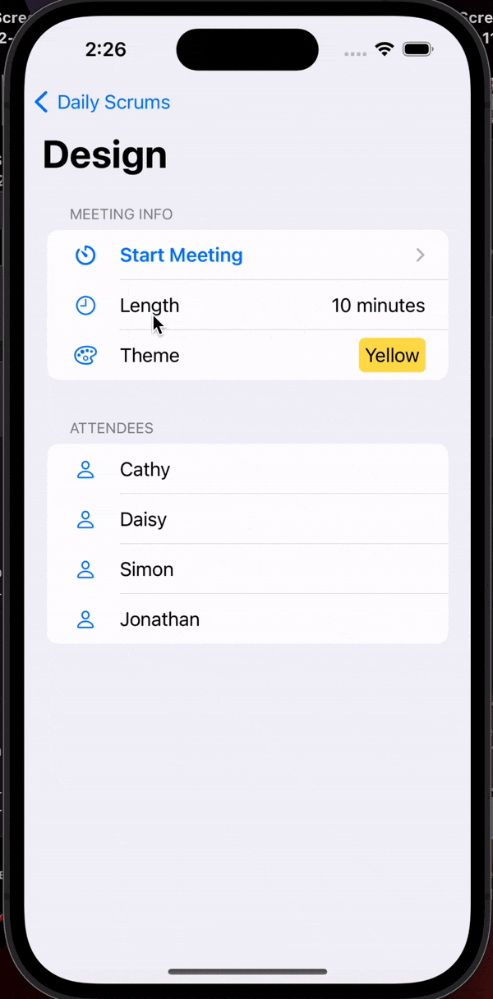

# Scrumy!

## What is it?
An iOS native application for Scrum meetings and logging!

Made using SwiftUI as an iOS development learning project following
https://developer.apple.com/tutorials/app-dev-training/

### What I learned

* Swift
* SwiftUI
* Structs
* Data Models
* State Management
* Working with iOS Dependencies
* Coding with Accessibility
* Usage of Guard Statement
* Closures in Swift
* Debugging using iOS Simulator

My first native iOS application